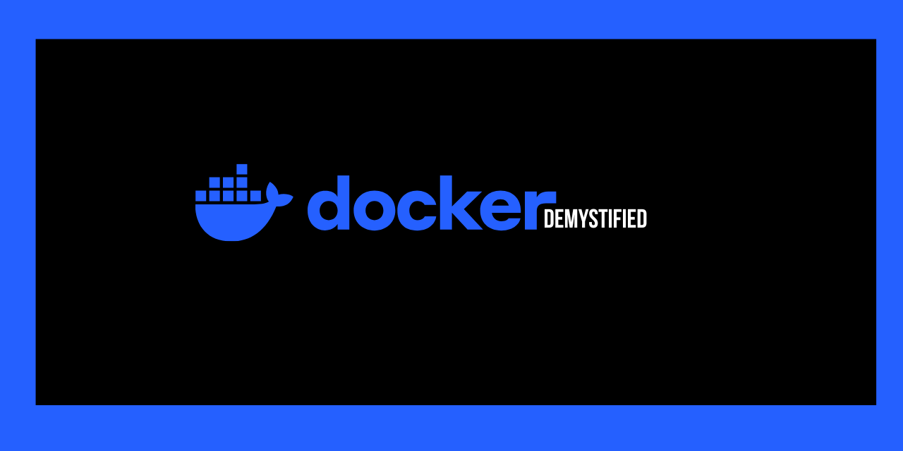

# Docker CLI Cheat Sheet

## Images
===
| Command | Description |
|---|---|
| `docker pull <image>:<tag>` | Download an image from a registry |
| `docker images` / `docker image ls` | List local images |
| `docker build -t <name>:<tag> .` | Build an image from a Dockerfile in current dir |
| `docker tag <image> <newname>:<tag>` | Tag an image (e.g. before pushing) |
| `docker push <user>/<image>:<tag>` | Push an image to a registry |
| `docker rmi <image>` | Remove a local image |
| `docker image prune` | Remove unused (dangling) images |
| `docker history <image>` | Show the layers of an image |
| `docker inspect <image>` | Show detailed metadata of an image |

## Containers

| Command | Description |
|---|---|
| `docker run <image>` | Create and start a container |
| `docker run -d <image>` | Run detached (in background) |
| `docker run -it <image> bash` | Run interactively with a shell |
| `docker run --name <name> <image>` | Run with a custom container name |
| `docker run -p <host>:<container> <image>` | Map a port |
| `docker run -e VAR=value <image>` | Set an environment variable |
| `docker run -v <host_path>:<container_path> <image>` | Mount a volume/bind mount |
| `docker ps` | List running containers |
| `docker ps -a` | List all containers (including stopped) |
| `docker start <container>` | Start a stopped container |
| `docker stop <container>` | Gracefully stop a running container |
| `docker restart <container>` | Restart a container |
| `docker kill <container>` | Force-stop a container immediately |
| `docker rm <container>` | Remove a stopped container |
| `docker rm -f <container>` | Force remove a running container |
| `docker container prune` | Remove all stopped containers |

## Inspecting & Debugging

| Command | Description |
|---|---|
| `docker logs <container>` | Show container logs |
| `docker logs -f <container>` | Follow (stream) container logs |
| `docker exec -it <container> bash` | Open a shell inside a running container |
| `docker inspect <container>` | Show detailed container metadata (JSON) |
| `docker stats` | Live resource usage (CPU, memory) for containers |
| `docker top <container>` | Show running processes inside a container |
| `docker diff <container>` | Show changed files vs. the base image |
| `docker port <container>` | Show port mappings |

## Docker Hub / Registries

| Command | Description |
|---|---|
| `docker login` | Log in to Docker Hub (or another registry) |
| `docker logout` | Log out |
| `docker search <term>` | Search Docker Hub for images |
| `docker pull <image>` | Pull an image |
| `docker push <image>` | Push an image |

## Volumes

| Command | Description |
|---|---|
| `docker volume create <name>` | Create a named volume |
| `docker volume ls` | List volumes |
| `docker volume inspect <name>` | Show volume details |
| `docker volume rm <name>` | Remove a volume |
| `docker volume prune` | Remove unused volumes |

## Networks

| Command | Description |
|---|---|
| `docker network ls` | List networks |
| `docker network create <name>` | Create a network |
| `docker network inspect <name>` | Show network details |
| `docker network connect <net> <container>` | Attach a container to a network |
| `docker network rm <name>` | Remove a network |

## Docker Compose

| Command | Description |
|---|---|
| `docker compose up` | Create and start all services in `docker-compose.yml` |
| `docker compose up -d` | Start in detached mode |
| `docker compose down` | Stop and remove containers, networks |
| `docker compose ps` | List running compose services |
| `docker compose logs -f` | Follow logs for all services |
| `docker compose build` | Build/rebuild services |

## System / Cleanup

| Command | Description |
|---|---|
| `docker system df` | Show disk usage by images/containers/volumes |
| `docker system prune` | Remove all unused containers, networks, images |
| `docker system prune -a --volumes` | Aggressive cleanup, including volumes |
| `docker version` | Show Docker client & server version |
| `docker info` | Show system-wide Docker info |
